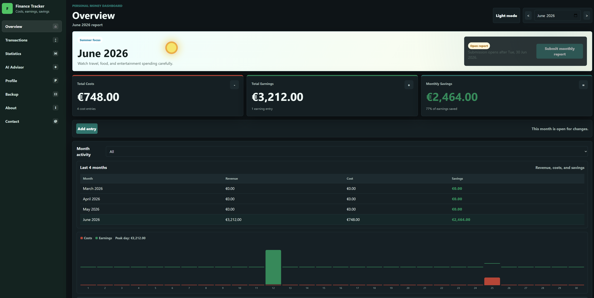

# Personal Finance Tracker

A clean personal finance web app for tracking daily costs, earnings, savings, monthly reports, and AI-based finance suggestions. I created this website to personally track my costs, understand my spending habits, and increase my savings with a simple but useful dashboard.



## Why This App Exists

Small daily expenses are easy to forget, but they can strongly affect monthly savings. This app gives one clear place to record costs and earnings, compare months, inspect categories, and understand where money is going. The goal is not only to store transactions, but also to turn them into useful decisions: what increased, what should be reduced, and how savings can improve.

## Main Features

- Add, edit, filter, and delete cost or earning transactions.
- Categorize costs such as accommodation, transport, internet, food, restaurant, entertainment, travel, health, education, and other.
- Track earnings such as salary, scholarship, freelance income, family support, refunds, and other income.
- View monthly costs, earnings, savings, and all-time savings.
- Compare the current month with the previous three months.
- Submit finished monthly reports and lock submitted months.
- Use light mode and dark mode.
- Use responsive desktop and mobile layouts.
- Review statistics with category charts, cost analysis, profit analysis, and savings summaries.
- Ask the AI Advisor questions about spending, savings, and planning.
- Register and login so each user has private cloud-synced finance data.
- Export and import JSON backups and CSV files.

## Live Website

The app is hosted as a static frontend on GitHub Pages:

```text
https://turgudvaliyev2002.github.io/personal-finance-tracker/
```

The AI Advisor backend is hosted separately with Vercel serverless functions.

## System Architecture

```text
Browser UI on GitHub Pages
        |
        |-- Firebase Authentication
        |     - Email/password registration
        |     - Email verification
        |     - Login/logout session handling
        |
        |-- Cloud Firestore database
        |     - User profile document
        |     - Private finance document per user
        |
        |-- Vercel API proxy
              - Keeps AI tokens hidden
              - Calls Hugging Face Inference Providers
              - Falls back safely when hosted AI is unavailable
```

## Database

The cloud database is **Firebase Cloud Firestore**.

Each signed-in user has isolated data under their own Firebase user ID:

```text
users/{uid}
users/{uid}/finance/default
```

The `users/{uid}` document stores profile information such as name, surname, gender, birth date, country of residence, and country of origin. The `users/{uid}/finance/default` document stores that user's finance entries, submitted monthly reports, and app preferences.

Firestore security rules should allow users to read and write only their own documents:

```text
rules_version = '2';
service cloud.firestore {
  match /databases/{database}/documents {
    match /users/{userId} {
      allow read, write: if request.auth != null && request.auth.uid == userId;
      match /finance/{document=**} {
        allow read, write: if request.auth != null && request.auth.uid == userId;
      }
    }
  }
}
```

## Login And Registration

Authentication is handled with **Firebase Authentication**.

The app uses email/password registration. During registration, the user enters basic profile details, an email address, and a password. Firebase creates the account and sends an email verification link. After login, the app loads that user's private finance data from Firestore. If the user logs out, the visible finance totals return to zero so another visitor does not see the previous user's data.

Passwords are never stored in this repository or in browser local storage. Firebase manages password storage and authentication securely.

## AI Advisor

The AI Advisor lets the user ask natural questions such as:

- How can I increase my savings?
- Which category is hurting my savings most?
- What changed compared with other months?
- How can I plan next month better?

The browser sends the question and finance summary to a Vercel backend endpoint:

```text
api/advisor.js
```

The backend keeps all model tokens hidden from the browser.

Current model chain:

1. Primary Hugging Face model: `meta-llama/Llama-3.3-70B-Instruct`
2. Hugging Face fallback model: `mistralai/Mistral-7B-Instruct-v0.3`
3. Local heuristic fallback inside the browser

The answer panel also shows which model produced the recommendation. If the hosted LLM fails because of quota, provider availability, or token problems, the local heuristic fallback still gives a useful recommendation from the user's finance data.

## Vercel Environment Variables

Set these variables in the Vercel project:

```text
HF_TOKEN=your_hugging_face_token
HF_MODEL=meta-llama/Llama-3.3-70B-Instruct
HF_FALLBACK_MODEL=mistralai/Mistral-7B-Instruct-v0.3
ALLOWED_ORIGIN=https://turgudvaliyev2002.github.io
```

Optional OpenAI fallback variables can also be added, but they are not required:

```text
OPENAI_API_KEY=your_openai_key
OPENAI_MODEL=gpt-4.1-mini
OPENAI_FALLBACK=true
```

## Firebase Setup

Create a Firebase project and enable:

- Firebase Authentication with Email/Password sign-in
- Cloud Firestore

Then add your Firebase web app config in `firebase-config.js`:

```js
window.FINANCE_FIREBASE_CONFIG = {
  apiKey: "YOUR_FIREBASE_WEB_API_KEY",
  authDomain: "YOUR_PROJECT.firebaseapp.com",
  projectId: "YOUR_PROJECT_ID",
  appId: "YOUR_FIREBASE_WEB_APP_ID"
};
```

The repository includes `firebase-config.example.js` as a template.

## Project Files

- `index.html` - page structure and app panels
- `styles.css` - desktop/mobile UI, animations, dark mode, and page design
- `app.js` - finance logic, charts, filters, profile page, AI Advisor UI, and local fallback
- `firebase-client.js` - Firebase Authentication and Firestore sync layer
- `firebase-config.js` - Firebase web configuration
- `api/advisor.js` - Vercel serverless AI Advisor proxy
- `service-worker.js` - offline cache for the hosted web app
- `manifest.webmanifest` - installable app metadata
- `assets/` - icons and screenshots

## Privacy Notes

The frontend is public because it is hosted on GitHub Pages, but private user data is not stored in the GitHub repository. Finance data is stored in Firestore under the signed-in user's Firebase account. AI API tokens are stored only in Vercel environment variables and are not exposed to the browser.

For important personal data, users should still export JSON backups regularly.

## Local Usage

Open `index.html` directly in a browser for basic local testing. For the full cloud version, configure Firebase and deploy the Vercel backend.

## Author

Created by **Turgud Valiyev** as a personal finance tracking and savings-improvement web app.
